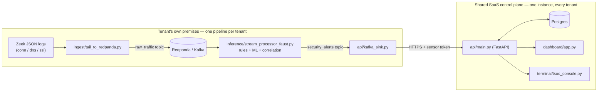
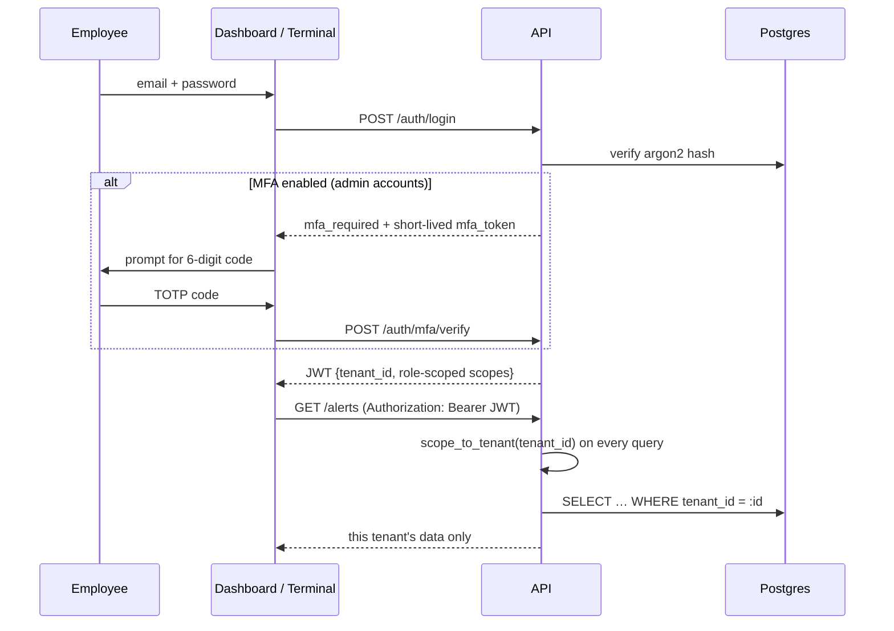
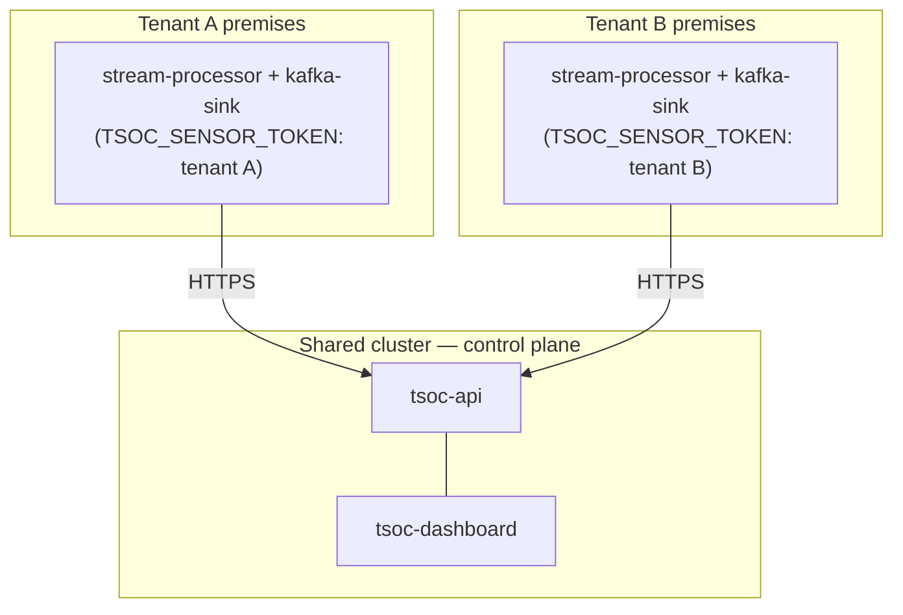

# TSOC — Data-Diode Threat Detection Platform

Real-time network threat detection for unidirectional (data-diode / passive-tap) environments, delivered as a multi-tenant SaaS: each customer's own premises run a one-way ingestion pipeline, while a shared control plane serves every tenant's employees through a web dashboard and a terminal console.

[](https://github.com/chakri192/NeuralSOC/actions/workflows/ci.yml)

## Contents

- [How it works](#how-it-works)
- [Multi-tenant accounts & security model](#multi-tenant-accounts--security-model)
- [Detection coverage](#detection-coverage)
- [Repository layout](#repository-layout)
- [Requirements](#requirements)
- [Configuration](#configuration)
- [Running locally](#running-locally)
- [Testing](#testing)
- [Retraining the models](#retraining-the-models)
- [Security](#security)
- [Deployment](#deployment)

## How it works

The platform never writes back to the monitored network — ingestion is read-only, matching a hardware data-diode's one-way link. Because of that, **each tenant's raw traffic pipeline runs at their own site**; only processed alerts ever cross into the shared SaaS.



**Ingestion and detection, per tenant:**

- `ingest/tail_to_redpanda.py` tails Zeek logs and publishes raw metadata to Kafka — read-only, no capability to talk back to the monitored network.
- `inference/stream_processor_faust.py` is the Faust worker that turns raw traffic into alerts:
  - `inference/rules.py` — rule-based heuristics (DDoS, beaconing, recon, DGA fallback, JA4 fingerprinting)
  - `inference/models.py` — PyTorch DGA/homoglyph classifier
  - `inference/correlation.py` — Redis-backed alert-to-incident correlation
  - `inference/enrichment.py` — IP/ASN/geo enrichment
- `api/kafka_sink.py` validates each alert against a strict schema, then POSTs it to the shared API's ingest endpoint, authenticated with that tenant's own sensor token — never a direct database write.
- `ingest/simulator.py` generates synthetic Zeek-style traffic (including labeled attack scenarios) so the whole pipeline can be exercised locally without a real data-diode feed.

**The shared control plane, serving every tenant:**

- `api/main.py` is the FastAPI backend — the only thing every tenant's data ever passes through.
- Three clients read from it, each with a different login model:

| Interface | Who uses it | How it authenticates |
|---|---|---|
| `dashboard/app.py` (Streamlit) | Every tenant's employees | Real per-employee account, JWT, optional MFA |
| `terminal/tsoc_console.py` (Textual TUI) | Employees who prefer a terminal | Same per-employee account as the dashboard |
| `dashboard/cli_dashboard.py` (Rich live feed) | Internal ops/on-call, single operator | One shared password (`DASHBOARD_PASSWORD`), read-only, no tenant scoping |

## Multi-tenant accounts & security model

Every alert, incident, and triage action belongs to exactly one **tenant**. An employee's JWT carries their `tenant_id`; every API query filters on it. There is no way to ask the API for another tenant's data through a request parameter — the tenant comes only from the verified token.



**Getting onto the platform:**

- `POST /auth/signup` is the only account-creation path that needs no existing account — it creates a brand-new tenant plus its first admin. Every account after that comes from an admin inviting a teammate (`POST /auth/tenants/{id}/users/invite`).
- `scripts/bootstrap_tenant.py` wraps signup + minting a sensor token into one CLI call — the fastest way to stand up a tenant for local dev or a demo.
- Three roles, each mapped to a fixed scope list (`api/models.py`'s `ROLE_SCOPES`): **analyst** and **lead** can read alerts/stats and write triage; **admin** can additionally invite/deactivate teammates, mint sensor tokens, enable MFA, and read the audit log.
- Every one of those admin actions has a real UI: `dashboard/pages/admin.py` ("Team & Access" in the sidebar, admin-only) — invite/deactivate teammates, mint and view sensor tokens, enroll/disable your own MFA, and browse the audit log. No SSH or CLI access required to run this day to day.

**Credentials, and what each one can do:**

| Credential | Identifies | Used by |
|---|---|---|
| Per-employee JWT | One person, at one tenant | Dashboard, terminal login |
| Sensor token | One tenant's collector, not a person | `api/kafka_sink.py` → ingest API |
| Static service key (`TSOC_API_KEY`) | A trusted internal caller, all tenants | Nothing in normal operation — legacy/internal use only |

**Defense in depth on the ingestion boundary:** `alerts.alert_id` carries a composite `(tenant_id, alert_id)` uniqueness constraint at the schema level, not just application-layer checks — two tenants can legitimately share an alert ID with zero conflict, and a genuine collision fails the database's own constraint rather than silently overwriting another tenant's row.

**Hardening once real accounts exist:**

- **Optional TOTP MFA for admin accounts** — enroll from the dashboard's Admin page or via `scripts/enroll_admin_mfa.py`; both walk through enroll → scan the QR / add the secret → confirm with a live code. The dashboard's login form handles the resulting two-step challenge; the terminal console shows a clear "use the dashboard instead" message rather than a confusing failure, since it has no code-entry screen yet.
- **Audit log** (`GET /api/v1/audit`, admin-only) — every login, invite, sensor-token creation, and triage change, per tenant, with actor, target, and timestamp.
- **Per-tenant rate limiting** — the alerts/stats/triage routes key their rate limit on `tenant_id`, not source IP, so one noisy tenant's employees can't exhaust a budget shared with everyone else on the same IP range.
- **Login protection** — 5 failed attempts locks an account out for 15 minutes; logout revokes that specific token via a Redis-backed denylist rather than waiting out its natural expiry.

## Detection coverage

| Category | Signal | Mechanism | MITRE ATT&CK |
|---|---|---|---|
| Volumetric / protocol DDoS | Incomplete TCP handshakes, UDP amplification | Connection-state tracking, packet-volume thresholds | T1498 |
| Botnet C2 beaconing | Periodic inter-arrival timing | Sliding-window mean/stddev/jitter on connection timing | T1071 |
| DGA & DNS tunnelling | Query entropy, length, record type | Domain entropy scoring, CNN classifier, TXT/hex parsing | T1568.002 / T1071.004 |
| Encrypted malware sessions | TLS metadata only, no decryption | JA4 fingerprint matching, SNI entropy | T1071.001 / T1573.002 |
| Reconnaissance / port scans | Fan-out across ports or hosts | Stateful vertical/horizontal scan tracking | T1046 |
| Data exfiltration | Outbound/inbound byte asymmetry | Byte-ratio thresholds | T1048 |

Detection thresholds are constants in `inference/rules.py` (the malicious-JA4-fingerprint list is the one exception, configurable via an environment variable); the dashboard's Network page only filters what's *displayed*, not what's detected.

## Repository layout

```
api/            FastAPI backend: auth, tenants/users, ORM models, audit log, Kafka→API ingest sink
inference/      Stream processor, detection rules, ML models, correlation
ingest/         Log tailer, PCAP ingester, synthetic traffic simulator
shared/         Code shared between the dashboard and terminal console
dashboard/      Streamlit web UI, plus cli_dashboard.py (Rich read-only live feed)
terminal/       Textual-based terminal console (triage: Ack/False Positive/Confirm)
scripts/        Tenant bootstrap, MFA enrollment, training, dev certs, integrity checks, backup/restore
alembic/        Database schema migrations
k8s/            Kubernetes manifests (NetworkPolicy, Kyverno, HPA, etc.); k8s-overlays/ for per-environment values
tests/          pytest suite (unit + integration + load)
docs/           Model methodology, rotation policy, threat taxonomy, disaster recovery
```

## Requirements

- Python 3.12 (CI target; 3.10+ generally works)
- Docker and Docker Compose (Redpanda, Postgres, Redis)
- `make` (optional, wraps the commands below)

## Configuration

Copy `.env.example` to `.env` and fill in the required values. At minimum, the API and stream processor will refuse to start without:

| Variable | Purpose |
|---|---|
| `DATABASE_URL` | Postgres connection string |
| `TSOC_API_KEY` | Static, all-tenant service credential — legacy internal use only, no normal request path needs it |
| `TSOC_JWT_SECRET` | HS256 signing secret, ≥32 bytes (RFC 7518 §3.2) — backs every per-employee login session |
| `TSOC_SENSOR_TOKEN` | This tenant's own ingest credential, minted via `POST /api/v1/ingest/tenants/{id}/sensor-tokens` (admin-only) — distinct from `TSOC_API_KEY` |
| `REDIS_PASSWORD` | Required whenever `REDIS_SSL=true` (the default) |

See `.env.example` for the full list, including optional CORS, proxy-trust, and docs-exposure settings.

For local TLS on Redis, generate self-signed dev certificates with:

```bash
scripts/generate_dev_certs.sh
```

Distributed tracing (`api/main.py`, `api/kafka_sink.py`, `inference/stream_processor_faust.py`) is opt-in:

- Set `OTEL_EXPORTER_OTLP_ENDPOINT=http://localhost:4318` to export spans to the `jaeger` service in `docker-compose.yml` (UI at http://localhost:16686).
- Unset, tracing is a real no-op (near-zero overhead) — nothing needs it configured to run normally.

### Database schema

Schema changes go through Alembic (`alembic/`), not `Base.metadata.create_all()` — the API's startup event still calls that too, but only to bootstrap tables on a brand-new database; it can't express a column or constraint change against one that already exists.

```bash
venv/bin/alembic upgrade head
```

A database that already has the `alerts` table from before Alembic existed (i.e. anything running before the `tenants`/`users` migration landed) should run `venv/bin/alembic stamp 95bddea6b154` once first, to mark that baseline as already applied without re-running its DDL, then `upgrade head` for everything after it.

## Running locally

```bash
# 1. Infrastructure (Redpanda, Postgres, Redis)
make up            # or: docker compose up -d

# 2. API -- start this before step 3, which needs it to be reachable
make api            # or: venv/bin/uvicorn api.main:app --host 0.0.0.0 --port 8000

# 3. Bootstrap a tenant, its first admin account, and an ingest sensor
#    token -- there is no other way to get a first account: /auth/login
#    needs an existing user, and the invite endpoint needs an existing
#    admin to call it. Prints a TSOC_SENSOR_TOKEN value; export it (or
#    add it to .env) before step 5.
PYTHONPATH=. venv/bin/python3 scripts/bootstrap_tenant.py

# 4. Stream processor
make pipeline       # or: PYTHONPATH=. venv/bin/python3 inference/stream_processor_faust.py worker -l info

# 5. Kafka-to-API sink -- required for alerts to actually persist;
#    without it the API/dashboards will show zero alerts indefinitely.
#    Needs TSOC_SENSOR_TOKEN from step 3.
make kafka-sink      # or: PYTHONPATH=. venv/bin/python3 api/kafka_sink.py

# 6. Dashboards (separate terminals). dashboard/app.py and
#    terminal/tsoc_console.py both log in with the real per-employee
#    account from step 3 (or any account created/invited since);
#    dashboard/cli_dashboard.py is the exception -- a read-only ops
#    view still gated behind the single shared DASHBOARD_PASSWORD (see
#    shared/auth.py), not a tenant account.
make dashboard       # or: venv/bin/streamlit run dashboard/app.py
make terminal        # or: PYTHONPATH=. venv/bin/python3 terminal/tsoc_console.py
make cli-dashboard   # or: PYTHONPATH=. venv/bin/python3 dashboard/cli_dashboard.py
                     # read-only, no triage actions -- use
                     # terminal/tsoc_console.py to Ack/False-Positive/Confirm

# 7. Synthetic traffic
make simulate        # or: venv/bin/python3 ingest/simulator.py --scenario mixed --burst

# 8. Optional: turn on TOTP MFA for the admin account from step 3
PYTHONPATH=. venv/bin/python3 scripts/enroll_admin_mfa.py --email <admin-email>
```

`make down` tears down the Docker infrastructure; `make clean` removes local `__pycache__`/log artifacts.

## Testing

```bash
pip install -r requirements-dev.txt
PYTHONPATH=. pytest tests/ -v --cov=api --cov=inference --cov=shared --cov=ingest --cov-report=term-missing
```

CI runs this on every push to `main`, alongside:

- `flake8` (blocking on genuine bugs — undefined names, syntax errors; full style report is advisory)
- `bandit` (fails on high-severity findings)
- `kubeconform` against every manifest in `k8s/` (base and both `k8s-overlays/` environments)
- a Docker build + Trivy scan (fails on HIGH/CRITICAL, unfixed CVEs ignored) for both published images
- CycloneDX SBOM generation
- keyless Sigstore signing + verification of the tracked model files
- a concurrent load test (`tests/test_load.py`) exercising the real correlation engine under burst traffic

See [SECURITY.md](SECURITY.md) for exactly what each of these verifies, current coverage numbers, and what still requires infrastructure this repository doesn't ship with (a live cluster, a real TLS-issuing domain).

## Retraining the models

Models are PyTorch, traced with TorchScript, and locked by a tracked SHA-256 sidecar (`models/*.pt.sha256`) that the stream processor verifies before loading.

To regenerate them against fresh synthetic data:

```bash
export PYTHONPATH=$(pwd)
venv/bin/python3 scripts/continuous_training.py
```

Let it run for one or two cycles and stop it (`Ctrl+C`) once validation accuracy is acceptable. It atomically swaps `models/cnn_dga.pt` and its `.sha256` without disrupting a running stream processor. `scripts/train_dl_models.py` is a shorter, one-shot alternative for both the DGA classifier and the flow autoencoder.

## Security

- JWT auth (PyJWT, HS256) with scoped, tenant-aware tokens, plus a static service key for internal callers.
- Optional TOTP MFA for admin accounts, enrolled from the dashboard's Admin page or `scripts/enroll_admin_mfa.py` (see [SECURITY.md](SECURITY.md) for what's wired into each client).
- Invite/deactivate teammates and mint sensor tokens from the dashboard's Admin page — no CLI or server access needed day to day.
- Real transactional email for invite/password-reset links via any SMTP-speaking provider (`api/email.py`) — falls back to logging the link when unconfigured, so local dev never needs real credentials.
- An audit log of every login, invite, sensor-token creation, and triage change, per tenant (`GET /api/v1/audit`, admin-only, also browsable from the dashboard).
- Rate limiting (slowapi) backed by Redis, keyed per-tenant on the routes where that matters (alerts/stats/triage), per-IP elsewhere.
- Kafka payloads validated against a strict schema before touching the database — no mass-assignment path from an untrusted message to the ORM.
- Model files are integrity-checked (SHA-256) before load and keylessly signed/verified via Sigstore in CI.
- Dependency vulnerabilities are scanned continuously via Dependabot (`pip` + `github-actions`).

Full details, current gaps, and how to independently verify the model signatures yourself: [SECURITY.md](SECURITY.md).

## Deployment



`k8s/soc-deployment.yaml` currently packages both the per-tenant pipeline and the shared control plane as one manifest set — correct for local dev, a demo, or a single self-hosted customer. Splitting it into two manifest sets is the natural next step once a second real tenant needs onboarding.

**What's in `k8s/`:**

- NetworkPolicies (default-deny plus explicit allow rules) and a Kyverno `ClusterPolicy` requiring signed, digest-pinned images.
- `HorizontalPodAutoscaler`s for the API, dashboard, and Kafka sink; a KEDA `ScaledObject` for the stream processor; a `PodDisruptionBudget` for all four.
- The stream processor is a `StatefulSet`, not a `Deployment`, since its DLQ volume is `ReadWriteOnce`.
- `k8s/secrets.yaml.example` is a template — populate a real `k8s/secrets.yaml` via Vault/Sealed Secrets, never commit it directly.

**Images and templating:**

- Two images are built and published to GHCR by CI's `publish-images` job on every push to `main`: the backend (`Dockerfile` — API, stream processor, and Kafka sink all share this one image) and the dashboard (`Dockerfile.dashboard`, a separate lean image that never ships `torch`/`faust-streaming`/`scikit-learn`/etc.).
- `k8s/soc-deployment.yaml`'s `your-registry.com/tsoc/...@sha256:...` image refs are placeholders — replace them with the real, digest-pinned GHCR images that job prints (Kyverno's `require-digest-pin` rule rejects anything else).
- `k8s/kustomization.yaml` lets the manifests be applied directly (`kubectl apply -k k8s/`) or layered with a per-environment overlay (`k8s-overlays/staging`, `k8s-overlays/production`) for environment-specific image digests, hostnames, and replica counts.

**TLS:** the API and dashboard Ingresses (`k8s/ingress.yaml`) need real, DNS-resolvable hostnames in place of the `api.tsoc.local`/`app.tsoc.local` placeholders before `letsencrypt-prod` (`k8s/cert-manager-public-ca.yaml`) can issue a certificate for either. See [SECURITY.md](SECURITY.md)'s TLS section for why this deployment uses two separate CAs — one public-facing, one internal-only for service-to-service mTLS.
