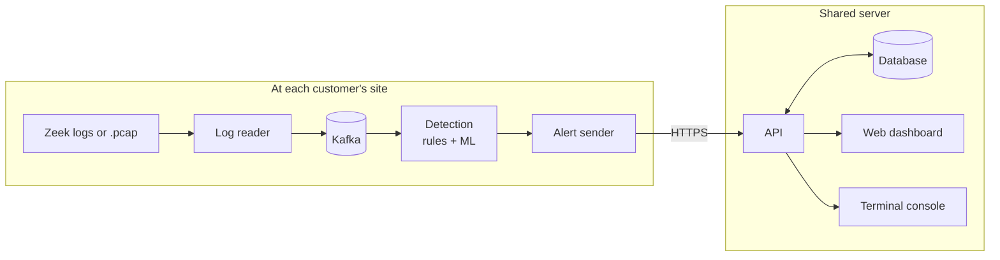

# NeuralSOC

Network threat detection for one-way (data-diode) networks. It reads network logs without ever sending anything back into the monitored network, detects attacks with rules and machine-learning models, groups alerts into incidents, and shows them in a web dashboard and a terminal console. Several companies (tenants) can share one installation, each seeing only their own data.

It's called **T-SOC**.

[](https://github.com/chakri192/NeuralSOC/actions/workflows/ci.yml)

## Demo

[](https://github.com/chakri192/NeuralSOC/releases/download/v1.0.0/NeuralSOC_5min_Video.mp4)

*Click to download and watch the 5-minute walkthrough (13MB, MP4).*

## How it works


```mermaid
flowchart LR
    subgraph site["At each customer's site"]
        zeek["Zeek logs or .pcap"] --> tail["Log reader"]
        tail --> kafka[("Kafka")]
        kafka --> detect["Detection<br/>rules + ML"]
        detect --> sink["Alert sender"]
    end
    subgraph cloud["Shared server"]
        sink -->|HTTPS| api["API"]
        api <--> db[("Database")]
        api --> dash["Web dashboard"]
        api --> term["Terminal console"]
    end
```

Raw traffic stays at the customer's site. Only alerts are sent to the shared server.

## What it detects

| Threat | How |
|---|---|
| Malware domains (DGA) | A neural network that spots machine-generated domain names, plus a check for very random-looking long names |
| DNS tunnelling | Long TXT-record queries |
| Infected hosts looking up domains | A host querying many new domains in a minute, or getting "no such domain" back for most of them |
| Newly registered domains | For domains the model already flagged, a lookup of how recently they were registered |
| DDoS | A flood of connections to one target in a few seconds, or very high packet counts |
| Botnet command-and-control | Connections to the same place at regular intervals, or small repeated messages on unusual ports |
| Data exfiltration | Over 1 MB sent to one destination in 10 minutes, or a single large upload |
| Port scans | Connection attempts that get no reply |
| Known malware in encrypted traffic | TLS (JA4) fingerprints matched against a list you supply |
| Unusual connections | A model trained on normal traffic flags connections that don't fit |

Each alert is tagged with its MITRE ATT&CK technique. Alerts from the same host are grouped into an incident with a risk score from 0 to 100; an incident is raised once the score reaches 50.

### Accuracy on real data

Tested against public datasets of real malware traffic, not just generated data:

| Detector | Precision | Recall | False positives |
|---|---|---|---|
| Malware domain (DGA) classifier | 84.6% | 77.2% | 13.9% |
| Unusual-connection model | 95.8% | 54.5% | 0.63% |
| Combined incident score | 98.3% | 53.0% | 1.15% |

Details and datasets are in [SECURITY.md](SECURITY.md#model-validation-against-real-world-data).

### Data sent outside your network

Two lookups go to public internet services:

- **IP information:** for alerts involving a public IP address, the IP is looked up at `ipwho.is` (private and internal addresses are never sent).
- **Domain age:** for domains the model has already flagged, the domain is looked up at `rdap.org`.

## Requirements

- macOS or Linux
- Python 3.12 (3.10+ works)
- Docker with Docker Compose

## Quick start

```bash
git clone https://github.com/chakri192/NeuralSOC.git
cd NeuralSOC
python3 -m venv venv
venv/bin/pip install -r requirements.txt
scripts/start_local_demo.sh
```

The script starts Docker (Kafka, Postgres, Redis), creates a `.env` with random local passwords, then starts the API, the detection pipeline, and the alert sender in the background. It also creates a demo account:

- **Email:** `admin@demo.local`
- **Password:** `DemoDay2026!`

It's safe to run again; anything already running is left alone. Logs go to `/tmp/tsoc-demo-api.log`, `/tmp/tsoc-demo-pipeline.log`, and `/tmp/tsoc-demo-sink.log`.

Then, in a new terminal, open the dashboard at http://localhost:8501:

```bash
set -a; source .env; set +a
venv/bin/streamlit run dashboard/app.py
```

And in another terminal, send some test traffic, including attacks:

```bash
export REDPANDA_BROKERS=127.0.0.1:9092
venv/bin/python3 ingest/simulator.py --scenario mixed --rate 15
```

Scenarios: `mixed`, `normal`, `dga`, `port_scan`. Add `--burst` for high volume.

To stop everything:

```bash
pkill -f 'uvicorn api.main:app'; pkill -f stream_processor_faust; pkill -f api/kafka_sink.py; pkill -f ingest/simulator.py
docker compose down
```

## Using your own traffic

Read Zeek logs as they're written (`conn.log`, `dns.log`, `ssl.log`):

```bash
venv/bin/python3 ingest/tail_to_redpanda.py --logs-dir /path/to/zeek/logs
```

Or replay a packet capture:

```bash
venv/bin/python3 ingest/pcap_ingester.py capture.pcap --broker localhost:9092
```

## Using it

### Web dashboard

| Page | |
|---|---|
| Incidents | Incidents sorted by severity. Open one for a summary, the attack timeline, every alert behind it, the ATT&CK mapping, and actions: Acknowledge, False Positive, or Confirm & Escalate |
| Investigate | Search by IP, domain, or alert ID |
| Network | Graph of which hosts are talking to each other |
| Health | Status of the detection pipeline |
| Team & Access | Admins only: invite or remove teammates, create sensor tokens, turn on two-factor login, and view the audit log |

### Terminal console

The same incidents and actions in the terminal, with the same login:

```bash
set -a; source .env; set +a
venv/bin/python3 terminal/tsoc_console.py
```

| Key | Action |
|---|---|
| `a` / `f` / `c` | Acknowledge / False positive / Confirm |
| `/` | Filter |
| `1`–`4` | Show critical / high / medium / low |
| `O` / `A` / `C` | Show open / acknowledged / confirmed |
| `p` | Pause live updates |
| `r` | Refresh |

`dashboard/cli_dashboard.py` is a read-only live feed for on-call staff. It uses one shared password (`DASHBOARD_PASSWORD` in `.env`) instead of personal accounts.

### Accounts and roles

| Role | Can |
|---|---|
| Analyst | View alerts and incidents, and triage them |
| Lead | Same as analyst |
| Admin | Also invite and remove teammates, manage sensor tokens, and view the audit log |

New teammates join by invitation from an admin. To create another company with its own admin:

```bash
PYTHONPATH=. venv/bin/python3 scripts/bootstrap_tenant.py --tenant-name "Acme" --email admin@acme.com
```

This prints the admin's password and a `TSOC_SENSOR_TOKEN`, which that company's alert sender uses to send alerts.

Admins can turn on two-factor login (authenticator app codes) from **Team & Access**, or with:

```bash
PYTHONPATH=. venv/bin/python3 scripts/enroll_admin_mfa.py --email admin@demo.local
```

## Settings

`scripts/start_local_demo.sh` writes a working `.env` for local use. For a real deployment, start from `.env.example`. The main settings:

| Variable | |
|---|---|
| `DATABASE_URL` | Database connection string (the demo uses a local SQLite file) |
| `TSOC_JWT_SECRET` | Secret for login sessions, at least 32 characters |
| `TSOC_API_KEY` | Internal service key |
| `TSOC_SENSOR_TOKEN` | The alert sender's credential, from `bootstrap_tenant.py` or **Team & Access** |
| `REDIS_PASSWORD` | Redis password (Redis uses TLS; `scripts/generate_dev_certs.sh` makes local certificates) |
| `DASHBOARD_PASSWORD` | Password for the read-only live feed |
| `ENABLE_DOCS` | `true` to serve the API docs at http://localhost:8000/docs |
| `SMTP_HOST`, `SMTP_PORT`, `SMTP_USERNAME`, `SMTP_PASSWORD`, `SMTP_FROM_ADDRESS` | Email for invitations and password resets. Without these, the links are written to the API log |
| `JA4_MALICIOUS_FINGERPRINTS` | Comma-separated TLS fingerprints to alert on. The default is a demo value only |
| `DGA_CLASSIFICATION_THRESHOLD` | How sure the domain model must be to alert (default `0.97`) |
| `OTEL_EXPORTER_OTLP_ENDPOINT` | Send traces to Jaeger (`http://localhost:4318`; UI at http://localhost:16686) |

The Python services don't read `.env` themselves, so load it into each terminal first with `set -a; source .env; set +a`.

After pulling changes that alter the database, update it with `venv/bin/alembic upgrade head`.

## Security

- Each company only ever sees its own data. The company comes from the login token, never from the request.
- Passwords are hashed with argon2. Five wrong passwords lock the account for 15 minutes.
- Every login, invitation, sensor token, and triage action is recorded in the audit log.
- Model files are checked against a hash before they're loaded, and signed in CI.

More in [SECURITY.md](SECURITY.md).

## Tests

```bash
venv/bin/pip install -r requirements-dev.txt
PYTHONPATH=. venv/bin/pytest tests/
```

## Retraining the models

```bash
PYTHONPATH=. venv/bin/python3 scripts/continuous_training.py
```

This retrains the malware-domain classifier and replaces the model file safely while detection keeps running. Stop it with `Ctrl+C` once accuracy is good enough. The unusual-connection model is retrained with `train_flow_autoencoder()` in `inference/train_model.py`.

## Backups

```bash
scripts/backup_postgres.sh               # timestamped database backup
scripts/restore_postgres.sh <backup>     # restore (replaces the current data)
```

Alerts that couldn't be delivered are kept on disk and can be re-sent with `scripts/replay_dlq.py`. See [docs/DISASTER_RECOVERY.md](docs/DISASTER_RECOVERY.md).

## Deployment

Kubernetes manifests are in `k8s/`, with staging and production settings in `k8s-overlays/`:

```bash
kubectl apply -k k8s/
```

Before deploying:

- Replace the placeholder image names in `k8s/soc-deployment.yaml` with the images CI publishes to GitHub Container Registry.
- Replace the placeholder hostnames in `k8s/ingress.yaml` with real domains so TLS certificates can be issued.
- Create `k8s/secrets.yaml` from `k8s/secrets.yaml.example`, using a secrets manager rather than committing it.

## Documentation

| | |
|---|---|
| [SECURITY.md](SECURITY.md) | Security design, test results, model validation |
| [docs/MODEL_METHODOLOGY.md](docs/MODEL_METHODOLOGY.md) | How the models are built and trained |
| [docs/THREAT_TAXONOMY.md](docs/THREAT_TAXONOMY.md) | Threats and their ATT&CK mappings |
| [docs/DISASTER_RECOVERY.md](docs/DISASTER_RECOVERY.md) | Backup and restore |
| [docs/MODEL_ROTATION.md](docs/MODEL_ROTATION.md) | Replacing models safely |
| [docs/DGA_MODEL_ROADMAP.md](docs/DGA_MODEL_ROADMAP.md) | What was tried on the DGA model, including what didn't work and why |

## License

MIT — see [LICENSE](LICENSE).
