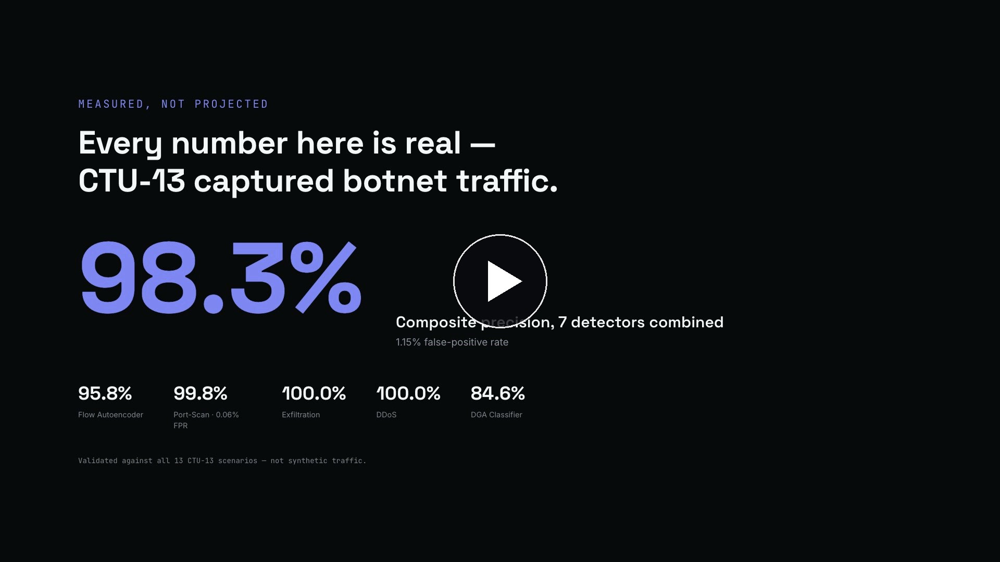
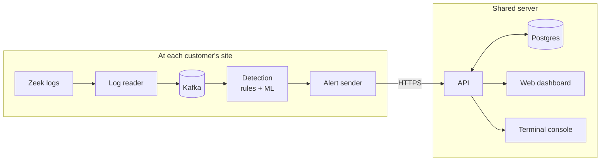

# NeuralSOC

Network threat detection for one-way (data-diode) networks. It reads network logs without ever sending anything back into the monitored network, detects attacks with rules and machine-learning models, groups alerts into incidents, and shows them in a web dashboard and a terminal console. Several companies (tenants) can share one installation, each seeing only their own data.

In the app it's called **T-SOC**.

[](https://github.com/chakri192/NeuralSOC/actions/workflows/ci.yml)

## Demo

[](https://github.com/chakri192/NeuralSOC/releases/download/v1.0.0/NeuralSOC_5min_Video.mp4)

*Click to download and watch the 5-minute walkthrough (13MB, MP4).*

## How it works


```mermaid
flowchart LR
    subgraph site["At each customer's site"]
        zeek["Zeek logs"] --> tail["Log reader"]
        tail --> kafka[("Kafka")]
        kafka --> detect["Detection<br/>rules + ML"]
        detect --> sink["Alert sender"]
    end
    subgraph cloud["Shared server"]
        sink -->|HTTPS| api["API"]
        api <--> db[("Postgres")]
        api --> dash["Web dashboard"]
        api --> term["Terminal console"]
    end
```

Raw traffic stays at the customer's site. Only alerts are sent to the shared server.

## What it detects

| Threat | How |
|---|---|
| DDoS | Incomplete TCP handshakes and traffic volume |
| Botnet command-and-control | Connections that repeat on a regular schedule |
| Malware domains (DGA) and DNS tunnelling | A neural network that spots machine-generated domain names, plus DNS record checks |
| Port and host scans | Many ports or hosts contacted in a short time |
| Data exfiltration | Unusually large outbound transfers |
| Unusual connections | A model trained on normal traffic flags connections that don't fit |

Each detection is mapped to its MITRE ATT&CK technique, and related alerts are combined into one incident with a single risk score.

### Accuracy on real data

Tested against public datasets of real malware traffic, not just generated data:

| Detector | Precision | Recall | False positives |
|---|---|---|---|
| Malware domain (DGA) classifier | 84.6% | 77.2% | 13.9% |
| Unusual-connection model | 95.8% | 54.5% | 0.63% |
| Combined incident score | 98.3% | 53.0% | 1.15% |

Details and datasets are in [SECURITY.md](SECURITY.md#model-validation-against-real-world-data).

## Requirements

- Python 3.12 (3.10+ works)
- Docker with Docker Compose
- `make` (optional)

## Setup

```bash
git clone https://github.com/chakri192/NeuralSOC.git
cd NeuralSOC
python3 -m venv venv
venv/bin/pip install -r requirements.txt
cp .env.example .env
```

Fill in `.env`. These are required:

| Variable | |
|---|---|
| `DATABASE_URL` | Postgres connection string |
| `TSOC_JWT_SECRET` | Secret for login sessions, at least 32 characters |
| `TSOC_API_KEY` | Internal service key |
| `REDIS_PASSWORD` | Redis password |
| `TSOC_SENSOR_TOKEN` | Created in step 3 below |

For local Redis over TLS, create development certificates:

```bash
scripts/generate_dev_certs.sh
```

Set up the database:

```bash
venv/bin/alembic upgrade head
```

## Run it locally

Each of these runs in its own terminal.

```bash
# 1. Start Kafka, Postgres, and Redis
make up

# 2. Start the API (http://localhost:8000)
make api

# 3. Create your company account and first admin.
#    Prints the admin login and a TSOC_SENSOR_TOKEN; add the token to .env
PYTHONPATH=. venv/bin/python3 scripts/bootstrap_tenant.py

# 4. Start detection
make pipeline

# 5. Start sending alerts to the API
make kafka-sink

# 6. Open the dashboard (http://localhost:8501) and log in with the account from step 3
make dashboard

# 7. Generate some test traffic, including attacks
make simulate
```

`make down` stops the Docker services.

To use your own company name and email in step 3:

```bash
PYTHONPATH=. venv/bin/python3 scripts/bootstrap_tenant.py --tenant-name "Acme" --email admin@acme.com
```

## Using it

### Web dashboard

| Page | |
|---|---|
| Incidents | Incidents sorted by severity. Open one to see a summary, every alert behind it, the ATT&CK mapping, an attack timeline, and actions: Acknowledge, False Positive, or Confirm & Escalate |
| Investigate | Search alerts |
| Network | Graph of which hosts are talking to each other |
| Health | Status of the detection pipeline |
| Team & Access | Admins only: invite or remove teammates, create sensor tokens, turn on two-factor login, view the audit log |

### Terminal console

The same incidents and actions in the terminal, using the same login:

```bash
make terminal
```

`make cli-dashboard` shows a read-only live feed for on-call staff. It uses a single shared password (`DASHBOARD_PASSWORD`) instead of personal accounts.

### Roles

| Role | Can |
|---|---|
| Analyst | View alerts and incidents, and triage them |
| Lead | Same as analyst |
| Admin | Also manage the team, sensor tokens, two-factor login, and the audit log |

New teammates join by invitation from an admin.

### Two-factor login

Admins can turn on authenticator-app codes from **Team & Access** in the dashboard, or with:

```bash
PYTHONPATH=. venv/bin/python3 scripts/enroll_admin_mfa.py --email admin@demo.local
```

## Security

- Each company only ever sees its own data. The company comes from the login token, never from the request.
- Passwords are hashed with argon2. Five wrong passwords lock the account for 15 minutes.
- Every login, invitation, token, and triage action is recorded in the audit log.
- Model files are checked against a signed hash before they're loaded.

More in [SECURITY.md](SECURITY.md).

## Tests

```bash
venv/bin/pip install -r requirements-dev.txt
PYTHONPATH=. venv/bin/pytest tests/
```

## Retraining the models

```bash
PYTHONPATH=. venv/bin/python3 scripts/continuous_training.py
```

This retrains the malware-domain classifier and replaces the model file safely while detection keeps running. Stop it with `Ctrl+C` once accuracy is good enough. The unusual-connection model is retrained with `train_flow_autoencoder()` in `inference/train_model.py`.

## Deployment

Kubernetes manifests are in `k8s/`, with staging and production settings in `k8s-overlays/`:

```bash
kubectl apply -k k8s/
```

Before deploying:

- Replace the placeholder image names in `k8s/soc-deployment.yaml` with the images CI publishes to GitHub Container Registry.
- Replace the placeholder hostnames in `k8s/ingress.yaml` with real domains so TLS certificates can be issued.
- Create `k8s/secrets.yaml` from `k8s/secrets.yaml.example`, using a secrets manager rather than committing it.

## Documentation

| | |
|---|---|
| [SECURITY.md](SECURITY.md) | Security design, test results, model validation |
| [docs/MODEL_METHODOLOGY.md](docs/MODEL_METHODOLOGY.md) | How the models are built and trained |
| [docs/THREAT_TAXONOMY.md](docs/THREAT_TAXONOMY.md) | Threats and their ATT&CK mappings |
| [docs/DISASTER_RECOVERY.md](docs/DISASTER_RECOVERY.md) | Backup and restore |
| [docs/MODEL_ROTATION.md](docs/MODEL_ROTATION.md) | Replacing models safely |
| [docs/DGA_MODEL_ROADMAP.md](docs/DGA_MODEL_ROADMAP.md) | What was tried on the DGA model, including what didn't work and why |

## License

MIT — see [LICENSE](LICENSE).
